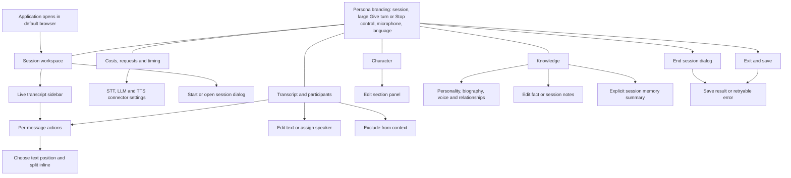
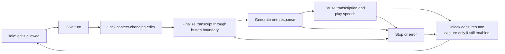
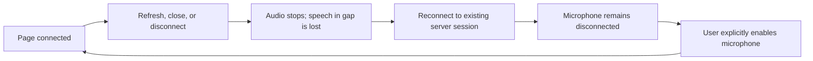
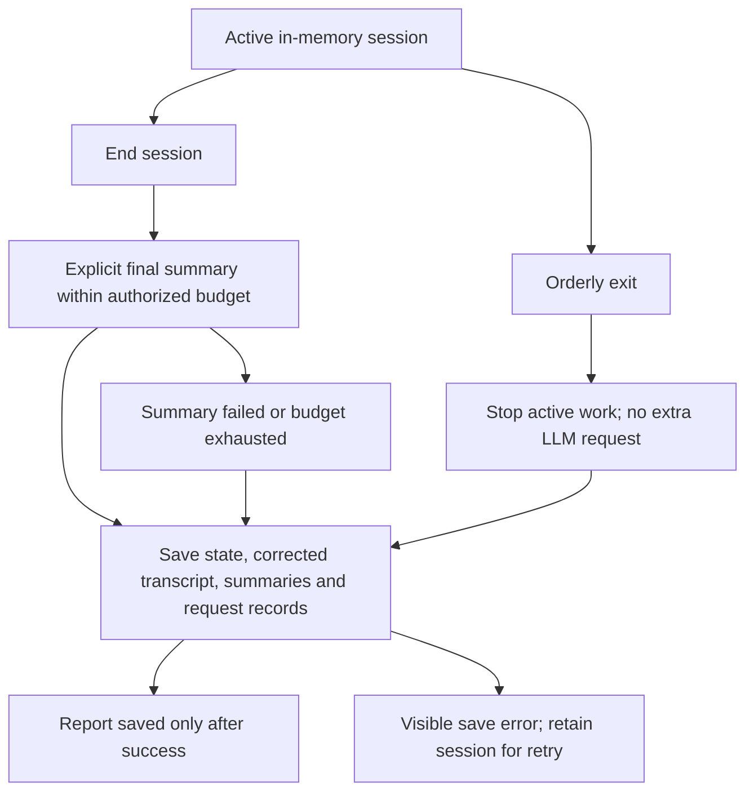

# Interface blueprint

Status: proposed UX specification for E-1, not implemented application behavior. The source scope is the agreed local development plan and epic interview. The existing application is unchanged by this document.

Open [interactive wireframes](ux-wireframes.html) in a browser to inspect the screen map, five workspace layouts, EN/RU labels, state variants, and session flows. The inspector belongs to this document, not to the product. Following the user's annotated review, it includes an explicitly fictional character, conversation, knowledge, memory summary, and diagnostic values. Preview edits affect only this page's in-memory demo; it makes no network requests and saves nothing. The demo never becomes the user's character template or real campaign data.

## Information architecture

There are five primary workspaces: Session, Character, Knowledge, Transcript, and Diagnostics. Session start/open/end and editing are dialogs or panels; splitting is inline. Basic provider connection settings belong in Diagnostics. Advanced administration, web-user accounts, automatic speaker identification, and iteration-two game mechanics are excluded.

## Shared shell

The compact header is present on every workspace. Place the small italic TTRPG label above an upright, bold PERSONA wordmark with restrained serifs. The primary button contains only its larger centered Give turn/Stop label, with no icon or explanatory subtitle. Put the prominent Give turn/Stop button in the open center of this same header; use a small microphone toggle beside the response state, language switch, and session menu on the right. Its revised desktop size is 273 by approximately 79.2 CSS pixels: 40% wider and 20% taller than the preceding 195 by 66 version. Session identity and the unsaved-session indicator sit below the wordmark. There is no separate tall control strip beneath the header. At narrow widths secondary controls wrap and the button can shrink to fit rather than hiding Stop in a menu. Do not repeat the active tab's title as another visible workspace heading.

Turn state and microphone state are separate. A muted microphone does not mean the turn is idle; transcription paused during speech is not the same as the user muting the microphone.

- While idle, the combined button says Give turn and is disabled if required session/provider data is unavailable. Once a turn starts it immediately becomes an enabled Stop button, remaining so throughout finalization, generation, and speech. A completed transcript can still be used while the microphone is muted/disconnected; microphone state alone is not a reason to prevent a response.
- Stop stops the turn, suppresses late speech, releases editing locks, and returns the same button to Give turn. Do not leave both competing primary buttons visible.
- Microphone control distinguishes an initial/disconnected microphone from a manually muted connection. A page reconnect never starts capture automatically.
- Tab navigation and language switching remain available while a turn is active.
- Context-changing edits are unavailable from the initial press through playback completion. Show one persistent explanation above the workspace and disable individual edit controls. The server must enforce the same restriction when the behavior is connected.
- A draft editor cannot silently feed uncommitted values into a response. Until the user applies or discards that local draft, Give turn is unavailable. Applying changes updates active session state; it does not claim to write a file.
- Use an understandable unsaved-state message such as "Saved when the session ends". Do not present browser-local draft edits or an in-memory Apply operation as a completed disk save.

## Workspace layouts

### Session

The primary reading area contains compact character identity and the last response, its kind, and playback status: completed, interrupted, or not started. The right column is a live chat-style transcript feed. Each utterance has an ellipsis menu for applicable actions: Edit, Assign speaker, Split, and Exclude. A Details link opens the full Transcript workspace. Do not duplicate a second recent-transcript block below the response. Costs, spending limits, request history, and timing belong in Diagnostics rather than on this play surface.

The sidebar and detailed transcript share the same records and edit operations. New finalized utterances appear as they arrive. Follow the bottom while the user is already there; preserve their reading position when they scroll upward and offer a New utterances control instead of jumping. In this artifact, Append demo utterance in the external inspector demonstrates an arrival without a real STT connection.

The empty state explains that a session/character must be loaded and offers Start session or Open saved session. Do not place account setup or a complex wizard in front of the initial UI preview. During E-1, disconnected functionality is visibly unavailable, while navigation and layout review remain possible.

### Character

Present identity/class/level at the top, followed by compact vitals, then structured sections: identity/appearance/origin; ability scores, HP, AC, speed, skills and saves; resources, conditions and temporary effects; inventory; features and spells. Personality, voice, biography, facts, and relationships move to Knowledge. This is a presentation change; it does not require moving those fields out of canonical character data.

Class and level are separate input fields. Class accepts text; level accepts a positive integer. In the preview these edits apply on leaving the field or pressing Enter; invalid or unfinished input prevents requesting a response. Other sections use Apply and Cancel rather than a separate full-page editor. Empty preview mode shows named fields and placeholders; fictional demo mode populates them with clearly isolated sample data. No derived-stat engine or automatic sheet modification is implied.

Below the main identity/vitals block, place skills/saving throws and inventory side by side as vertical panels. Skills and saving throws are individual list rows rather than a dot-separated sentence. Each inventory row contains item text, a minus/quantity/plus control, and Remove; omit the description column. A quantity of zero is allowed and does not implicitly delete the row. Add item at the bottom opens a single text-field dialog and inserts the item with quantity one. All mutations obey the context-edit lock.

Spells occupy a wide block below the inventory/skills row, grouped by spell level with the corresponding available/total slots. Cantrips are separate and do not consume slots. Show empty groups appropriately without inventing unavailable spells. Features remain in the right-hand panel, separate from spells. These are manual displays/editors, not automatic casting or resource deduction.

### Knowledge

Use a working internal section selector for World, Personality & background, and Session notes. Show only the selected section in the main column. World facts contain text, status, and source; technical IDs are retained but need not dominate the view. Personality & background contains biography, traits, ideals, bonds, flaws, goals, voice, relationships, and character facts. Session notes contains the user's editable notes without redundantly repeating the selected section name as another panel title.

A separate Session memory panel remains alongside these sections. Present one concise, connected paragraph summarizing the current session situation and the character's place in it: their condition, intentions, commitments, and uncertainty. Do not repeat the knowledge section's categorical structure or headings. The summary draws on included conversation and current character data, preserving uncertainty in the prose. Display its last incorporated conversation boundary and validity state separately. It is neither hidden model reasoning nor a complete dump of every input in the response context; recent utterances and selected knowledge also contribute to a response. Manual summary editing uses one text field.

The summary shows whether it is current, updating, or invalidated by an edit. An invalidated summary is not treated as usable just because it is the latest completed one. Human-authored notes and model-generated summaries must remain visibly distinct. Summary editing uses the same turn lock as other context edits; a background update alone does not lock the user out of editing while no response turn is active.

### Transcript and participants

The main column is chronological text with timestamp, optional speaker/role, and inclusion state. It is the expanded workspace for the same entries and ellipsis actions available in the Session sidebar, not a second transcript. Interim recognition is visually separate and cannot yet be edited. Excluded rows remain identifiable and can be included again; they are not silently deleted. The same context-edit lock applies in both views.

A compact participant panel permits manual names and roles, including DM and Player. An unknown speaker is valid. Agent entries are added by the backend and display playback status rather than being recognized again from audio.

Choosing Split from an utterance's menu activates position selection directly in that utterance. Clicking an interior text position immediately replaces the original with two entries; keyboard users move the caret and press Enter, with Escape to cancel. Both parts inherit the original speaker, who can then be reassigned independently. Reject a boundary that would leave an empty part. Splitting can be repeated. There is no separate split explainer card, split dialog, or confirmation step. The fictional preview implements these local operations and synchronizes both views.

### Diagnostics

Use two internal sections: Usage & requests and Connections. The first contains session total, last-response cost, spending ceiling, component breakdown, request history, and stage timing. Unknown values display a dash; estimated costs are labeled. Real diagnostics must distinguish provider-reported usage from estimates and keep authentication material out of display and logs. The filled preview uses expressly illustrative values and Demo adapter names; they are not selected providers, real measurements, or incurred charges.

Connections provides independent STT, LLM, and TTS setup after deployment, without rebuilding the app or embedding the user's access in its distribution. Show provider/adapter, API base URL, model, API-key configuration status, optional project/organization where supported, STT recognition language, and TTS voice ID. Actual supported options come from the implemented adapters; this preview lists fictional adapters only. Basic configuration must be reachable even before opening a session.

Provider credentials belong to private server-side application settings, separate from campaign JSON, model context, request diagnostics, and shipped assets. The future application can accept a key through a masked field and subsequently return only its configuration status; never echo a saved secret into diagnostics. Credential persistence will be implemented with provider integration, not by browser storage in this specimen. Switching a connector is unavailable during an active response; applying STT changes leaves capture disconnected until explicitly enabled again. Connection checks must not run automatically on typing or saving and must respect any billing authorization needed for the concrete check.

In the HTML specimen, the API-key field is disabled, empty, and labeled as available only in the connected application. No real key can be entered or retained. Apply changes only fictional connector metadata in page memory; Test connection is disabled and no request is sent. This keeps configuration layout review separate from implementing actual authentication and private storage.

## Dialog and panel inventory

| Surface | Entry | Content and primary action | Exit/failure behavior |
| --- | --- | --- | --- |
| Start/open session | Session empty state or session menu | Load the character/knowledge or a saved snapshot into a session | Invalid input stays in the dialog with an English/Russian UI error; no partial success claim |
| Edit section/fact/notes/summary | Section action | Fields or text, Apply, Cancel | Applying updates session memory; invalid input leaves the draft intact; unavailable during a response |
| Add inventory item | Bottom of inventory | One required text field, Add, Cancel; initial quantity one | No description field; blank input is rejected; obeys the turn lock |
| Configure connector | Diagnostics → Connections | Provider, API URL, model, optional project, STT language or TTS voice; masked key in the actual app | Accessible without a session; changes blocked during a turn; prototype key entry/testing disabled |
| Edit/assign utterance | Ellipsis menu in chat or detailed transcript | Text or speaker, Apply, Cancel | Same records, lock, and validation in both views; accepted changes invalidate affected derived memory |
| Split utterance inline | Ellipsis menu in either transcript view | Click a position in the text; immediately create two parts with inherited speaker | No dialog; reject empty parts; Escape cancels; resulting parts can be split again or reassigned |
| Exclude/include utterance | Ellipsis menu in either transcript view | Toggle model-context inclusion, retain identifiable row | Blocked during a turn; derived memory is invalidated when accepted |
| End session | Session menu | Explain final summary generation and retaining the corrected transcript; End session, Cancel | Finish the turn first or use Stop; summary failure/limit does not prevent retaining the transcript and saving state |
| Exit and save | Session menu or orderly application shutdown | Stop active work and save current state without another LLM call | On a controllable save failure, keep the session available for retry; forced termination cannot guarantee saving |
| Save error | Completion/exit | Explain the failure and offer Retry | Do not clear the in-memory session or report success while the save failed |
| Delete saved transcript | Completed session after summary review | Explicit confirmation covering transcript and conversation-bearing diagnostics/backups | Separate from exclusion and session completion; never an automatic cleanup |

The End session and save-error dialogs remain schematic and cannot claim successful saving. The fictional preview permits local section/text edits, author assignment, inline splitting, and exclusion/inclusion. These demonstrate interaction only; no server-side feature or session persistence has been implemented by this artifact.

## Core flows

## State and language coverage

| State | What remains available | What changes |
| --- | --- | --- |
| No session | Navigation, language, start/open | No fabricated character, costs, response, or connected microphone |
| Fictional demo / ready | Local preview controls and edits | All five tabs contain sample data; costs are explicitly not billed; resetting/reloading discards demo changes |
| Finalizing/thinking | Stop, mute, navigation, language | Give turn and context-changing edits disabled; progress shown |
| Speaking | Stop, mute, navigation, language | Same edit lock; transcription visibly paused |
| Muted | Navigation, edits while idle, Give turn when context is ready | Microphone sends nothing; do not auto-unmute after speech |
| Disconnected | Existing server-side data, navigation, applicable idle edits | Explicit reconnect-microphone action; no automatic capture |
| Provider failure | Navigation, Stop if needed, retry via a new user action | Clear error, idle/edit lock recovery, no automatic extra paid request |
| Summary invalidated | Idle edits and existing canonical content | Old summary visibly unavailable; no stale-summary fallback |
| Save failed | Current session and retry | No success indication or automatic loss of data |

All application labels, validation, dialogs, accessibility labels, and status/error presentation have EN and RU translations. Language switching preserves selected tab, current modal, local drafts, and active session state; it updates the document language and locale-sensitive display formatting. Default-language selection and persistence are implementation defaults, not a reason to delay the first shell. Do not translate campaign text, character names, transcript text, or agent utterances when switching UI language. Backend logs and code remain English.

## E-1 review checklist

- Navigate all five workspaces in EN and RU, including long labels and narrow desktop windows.
- Inspect empty, populated placeholder, reply-locked, muted/disconnected, and error states.
- Verify Stop and microphone controls stay discoverable from every tab; turn state and microphone state are distinct.
- Inspect shared chat/transcript menus, inline splitting and inherited speakers, edit/Apply terminology, and the difference between exclusion, final saving, and deleting saved conversation data.
- Confirm that no fixture, preview action, or unknown cost is presented as a real successful feature.
- Build real feature behavior into these same surfaces incrementally in later epics; the blueprint itself is not evidence that those contracts are implemented.
